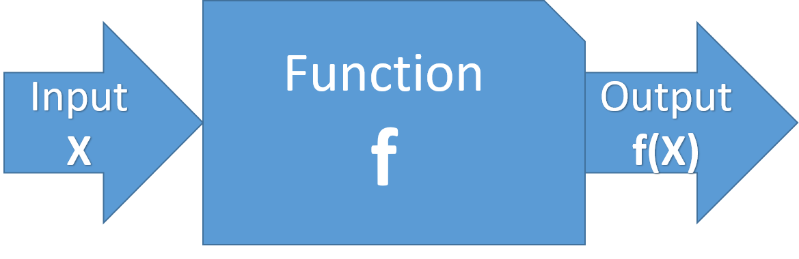

# Section 1 - About Functional Programming 
---


## What is Functional Programming

Functional programming is a programming paradigm that revolves around **pure functions**. 
A **pure function** is a function which can be represented as a mathematical expression. That means, no **side-effects** should be present, i.e. no I/O operations, no global state changes, no database interactions. 



The output from a pure function is depended **ONLY** on its inputs. Thus, if a pure function is called with the same inputs a million times, you would get the same result every single time.


```python
# unfunctional function
a = 0

def global_sum(x):
    global a
    x += a
    return x

print(global_sum(1))
print(a)
a = 11
print(global_sum(1))
print(a)
```

    1
    0
    12
    11
    

In the above example, the output of the function `global_sum` changed due to the value of `a`, thus it is unfunctional function.


```python
# functional function
def better_sum(a, x):
    return a+x

num = better_sum(1, 1)
print(num)
num = better_sum(1, 3)
print(num)
num = better_sum(1, 1)
print(num)
```

    2
    4
    2
    

and in the above example `better_sum`, the function returns always the same value for the set of input and only provided input can have any impact on the output of the function.

## Functions as First-Class citizens

In functional programming, functions can be treated as objects. That is, they can assigned to a variable, can be passed as arguments or even returned from other functions.

### The lambda

The simplest way to initialize a pure function in python is by using `lambda` keyword, which helps in defining the one-line function. Functions initialized with lambda can often called `anonymous functions`


```python
# Example lambda keyword

product_func = lambda x, y: x*y

print(product_func(10, 20))
```

    200
    

### Functions as Objects

Functions are first-class objects in Python, meaning they have attributes and can be referenced and assigned to variables.


```python
def square(x):
    """
    This returns the square of the requested number `x`
    """
    return x**2

print(square(10))

# Assignation to another variable
mySquare = square
print(mySquare(100))
print(square)
print(mySquare)
print(id(square))
print(id(mySquare))

# attributes present
print("*"*30)
print(dir(square))
print("*"*30)
print(square.__name__)
print("*"*30)
print(square.__doc__)

```

    100
    10000
    <function square at 0x000002294C383488>
    <function square at 0x000002294C383488>
    2376395666568
    2376395666568
    ******************************
    ['__annotations__', '__call__', '__class__', '__closure__', '__code__', '__defaults__', '__delattr__', '__dict__', '__dir__', '__doc__', '__eq__', '__format__', '__ge__', '__get__', '__getattribute__', '__globals__', '__gt__', '__hash__', '__init__', '__init_subclass__', '__kwdefaults__', '__le__', '__lt__', '__module__', '__name__', '__ne__', '__new__', '__qualname__', '__reduce__', '__reduce_ex__', '__repr__', '__setattr__', '__sizeof__', '__str__', '__subclasshook__']
    ******************************
    square
    ******************************
    
        This returns the square of the requested number `x`
        
    

### higher-order function

Python also supports higher-order functions, meaning that functions can accept other functions as arguments and return functions to the caller.


```python
print(square(square(square(2))))
```

    256
    


```python
product_func = lambda x, y: x*y

sum_func = lambda F, m: lambda x, y: F(x, y)+m

print(sum_func(product_func, 5)(2, 4)) 
```

    13
    

13=2*4+5

In the above example higher-order function that takes two inputs- A function `F(x)` and a multiplier `m`.

### Nested Functions

In Python, Function(s) can also be defined within the scope of another function. If this type of function definition is used the inner function is only in scope inside the outer function, so it is most often useful when the inner function is being returned (moving it to the outer scope) or when it is being passed into another function.

Notice that in the below example, a new instance of the function `inner()` is created on each call to `outer()`. That is because it is defined during the execution of `outer()`. The creation of the second instance has no impact on the first.


```python
def outer():
    """
    Outer function 
    """
    if 'a' in locals():
        a +=10
    else:
        print("~"),
        a = 20
    def inner(x):
        """
        inner function
        """
        return(x*x*a)
    print(a)
    return inner

o = outer()
print("*"*20)
print(o)
print(o(10))

b = outer()
print(b)
print(b(20))
```

    ~
    20
    ********************
    <function outer.<locals>.inner at 0x000002294C383A60>
    2000
    ~
    20
    <function outer.<locals>.inner at 0x000002294C3AC488>
    8000
    

## Inner / Nested Functions - When to use 

### Encapsulation
You use inner functions to protect them from anything happening outside of the function, meaning that they are hidden from the global scope.


```python
# Encapsulation

def increment(current):
    def inner_increment(current):  # hidden from outer code
        return current + 1
    next_number = inner_increment(current)
    print(current, next_number)

increment(10)
# inner_increment(10) # Will Fail
# outer(10).inner_increment(2) # Will Fail
```

    10 11
    


```python
def update(str_val):
    def updating(ori_str, key, value):
        token = "$"
        if key in ori_str:
            ori_str = ori_str.replace(token+key, value)
        return ori_str
    
    keyval = [{"test1": "val_test", "t1" : "val_1"}, {"test2": "val_test2", "t2" : "val_2"}]

    keyval1 = [{"test1": "val_test", "t1" : "val_1"}, {"test2": "val_test2", "t2" : "val_2"}]
    ori_str = "This is a $test1 and $test2, $t1 and $t2"
    
#     for k in keyval:
#         for key, value in k.items():
#             ori_str = updateing(ori_str, key, value)
    
    sdd = [ key, value [for key, value in k] for(k in keyval) ]
    
    print(ori_str)
    
update("D")
```


      File "<ipython-input-17-4c5edce7660a>", line 17
        sdd = [ key, value [for key, value in k] for(k in keyval) ]
                              ^
    SyntaxError: invalid syntax
    


```python
ld = [{'a': 10, 'b': 20}, {'p': 10, 'u': 100}]
[kv for d in ld for kv in d.items()]
```


    [('a', 10), ('b', 20), ('p', 10), ('u', 100)]


```python
ori_str = "This is a $test;1 and $test2, $t1 and $t2"
print(ori_str.replace("test1", "TEST1"))
print(ori_str)
```

    This is a $TEST1 and $test2, $t1 and $t2
    This is a $test1 and $test2, $t1 and $t2
    

### Following DRY (Don't Repeat Yourself)

This type can be used if you have a section of code base in function is repeated in numerous places. For example, you might write a function which processes a file, and you want to accept either an open file object or a file name:


```python
# Keepin’ it DRY

def process(file_name):
    def do_stuff(file_process):
        for line in file_process:
            print(line)

    if isinstance(file_name, str):
        with open(file_name, 'r') as f:
            do_stuff(f)
    else:
        do_stuff(file_name)
        

```

or have similar logic which can be replaced by a function, such as mathematical functions, or code base which can be clubed by using some parameters.  


```python
def square(n):
    return n**2

def cube(n):
    return n**3

print(square(2))
```

    4
    


```python
def power(exp):
    def subfunc(a):
        return a**exp
    return subfunc

square = power(2)
hexa = power(6)

print(square(5))
print(hexa(3))
print(power(6)(3))
```

    25
    729
    729
    


```python

```

#### Closures and Factory Functions (1)

In programming languages, closures (also lexical closures or function closures) are techniques for implementing lexically scoped name binding in languages with first-class functions. Operationally, a closure is a record storing a function[a] together with an environment:[1] a mapping associating each free variable of the function (variables that are used locally, but defined in an enclosing scope) with the value or reference to which the name was bound when the closure was created.[b] A closure—unlike a plain function—allows the function to access those captured variables through the closure's copies of their values or references, even when the function is invoked outside their scope.


```python
def f(x):
    def g(y):
        return x + y
    return g

def h(x):
    return lambda y: x + y

a = f(1)
b = h(1)
print(a, b)
print(a(5), b(5))
print(f(1)(5), h(1)(5))
```

    <function f.<locals>.g at 0x000001ECFA3A3268> <function h.<locals>.<lambda> at 0x000001ECFA3A3598>
    6 6
    6 6
    

both a and b are closures—or rather, variables with a closure as value—in both cases produced by returning a nested function with a free variable from an enclosing function, so that the free variable binds to the parameter x of the enclosing function. However, in the first case the nested function has a name, g, while in the second case the nested function is anonymous. The closures need not be assigned to a variable, and can be used directly, as in the last lines—the original name (if any) used in defining them is irrelevant. This usage may be deemed an "anonymous closure".

**1: Copied from** : "https://en.wikipedia.org/wiki/Closure_(computer_programming)"


```python
def make_adder(x):
    def add(y):
        return x + y
    return add

plus10 = make_adder(10)
print(plus10(12)) 
```

    22
    

Closures can avoid the use of global values and provides some form of data hiding. It can also provide an object oriented solution to the problem.

When there are few methods (one method in most cases) to be implemented in a class, closures can provide an alternate and more elegant solutions. But when the number of attributes and methods get larger, better implement a class.


```python

```


```python

```

### Comprehensions

Using comprehensions is often a way both to make code more compact and to shift our focus from the “how” to the “what.” A comprehension is an expression that uses the same keywords as loop and conditional blocks, but inverts their order to focus on the data rather than on the procedure. Simply changing the form of expression can often make a surprisingly large difference in how we reason about code and how easy it is to understand. The ternary operator also performs a similar restructuring of our focus, using the same keywords in a different order.


####  List Comprehensions

* Unconditional Compreshensions 


```python
numbers = [1, 2, 3, 4, 5]

doubled_numbers = [n * 2 for n in numbers]

print(doubled_numbers)
```

    [2, 4, 6, 8, 10]
    

* Conditional Compreshensions 


```python
numbers = [1, 2, 3, 4, 5]

doubled_odds = []
for n in numbers:
    if n % 2 == 1:
        doubled_odds.append(n * 2)
print(doubled_odds)
```

    [2, 6, 10]
    


```python
doubled_odds = [n * 2 for n in numbers if n% 2 == 1]

print(doubled_odds)
```

    [2, 6, 10]
    

** !!!! Tip !!!! ** 

* Copy the variable assignment for our new empty list (line 3)
* Copy the expression that we’ve been append-ing into this new list (line 6)
* Copy the for loop line, excluding the final : (line 4)
* Copy the if statement line, also without the : (line 5)


```python
# FROM
numbers = range(2,10)

doubled_odds = []
for n in numbers:
    if n % 2 == 1:
        doubled_odds.append(n * 2)
```


```python
# TO
numbers = range(2,10)

doubled_odds = [n * 2 for n in numbers if n % 2 == 1]

```

### Nested Loops


```python
### TODO ####
matrix = [1, 2, 3, [4, 5, 6], [7, 8], [9, 10]]
flattened = []
for row in matrix:
    if isinstance(row, list):
        for n in row:
            flattened.append(n)
    else:
        flattened.append(row)

print(flattened)
```

    [1, 2, 3, 4, 5, 6, 7, 8, 9, 10]
    


```python

```


```python

```


```python
import os

htmlFiles = []

for d in os.walk(r"C:\apps\PortableGit"):
    for f in d[2]:
        if f.endswith(".html"):
            htmlFiles.append(os.path.join(d[0], f))
        
print(len(htmlFiles))
```

    237
    


```python
%%time

import os
htmlFiles = []
htmlFiles = [os.path.join(d[0], f) for d in os.walk(r"C:\apps\PortableGit")
             for f in d[2] if f.endswith(".html")]

print(len(htmlFiles))
```

    237
    Wall time: 672 ms
    


```python
%%time
restFiles = []

for d in os.walk(r"C:\apps\PortableGit"):
    if "etc" in d[0]:
        for f in d[2]:
            if f.endswith(".conf"):
                restFiles.append(os.path.join(d[0], f))
print(len(restFiles))
```

    1
    Wall time: 641 ms
    


```python
restFiles = [os.path.join(d[0], f) 
                 for d in os.walk(r"C:\apps\PortableGit") 
                     if "etc" in d[0]
                         for f in d[2] 
                             if f.endswith(".conf")]
print(len(restFiles))
```

    1
    


```python
%%time
matrix = []
for row_idx in range(0, 3):
    itmList = []
    for item_idx in range(0, 3):
        if item_idx == row_idx:
            itmList.append(1)
        else:
            itmList.append(0)
    matrix.append(itmList)
print(matrix)
```

    [[1, 0, 0], [0, 1, 0], [0, 0, 1]]
    Wall time: 0 ns
    


```python
matrix = [ [ 1 if item_idx == row_idx else 0 for item_idx in range(0, 3) ] for row_idx in range(0, 3) ]
print(matrix)
```

    [[1, 0, 0], [0, 1, 0], [0, 0, 1]]
    


```python

```

### Set Comprehensions

Set comprehensions allow sets to be constructed using the same principles as list comprehensions, the only difference is that resulting sequence is a set and **"{}"** are used instead of **"[]"**.


```python
names = [ 'Aalok', 'Manish', 'Aalok', 'Manish', 'Gupta', 'Johri', 'Mayank' ]

new_names1 = [ name[0].upper() + name[1:].lower() for name in names if len(name) > 1 ]
new_names = { name[0].upper() + name[1:].lower() for name in names if len(name) > 1 }
print(new_names1)
print(new_names)
```

    ['Aalok', 'Manish', 'Aalok', 'Manish', 'Gupta', 'Johri', 'Mayank']
    {'Aalok', 'Mayank', 'Manish', 'Gupta', 'Johri'}
    


```python

```

### Dictionary Comprehensions


```python
original = {'a':10, 'b': 34, 'A': 7, 'Z':3}

mcase_frequency = { k.lower() : original.get(k.lower(), 0) + original.get(k.upper(), 0) for k in original.keys() }
print(mcase_frequency)
```

    {'a': 17, 'b': 34, 'z': 3}
    


```python
flipped = {value: key for key, value in original.items()}
print(flipped)
```

    {10: 'a', 34: 'b', 7: 'A', 3: 'Z'}
    


```python

```

### Generator Comprehension

They are simply a generator expression with a parenthesis "()" around it. Otherwise, the syntax and the way of working is like list comprehension, but a generator comprehension returns a generator instead of a list. 


```python
x = (x**2 for x in range(20))
print(x)
print(list(x))
```

    <generator object <genexpr> at 0x000001ECFA355FC0>
    [0, 1, 4, 9, 16, 25, 36, 49, 64, 81, 100, 121, 144, 169, 196, 225, 256, 289, 324, 361]
    


```python
itm = 10
print(itm / 2)
```

    5.0
    

#### Summary

When struggling to write a comprehension, don’t panic. Start with a for loop first and copy-paste your way into a comprehension.

Any for loop that looks like this:


```python
def condition_based_on(itm):
    return itm % 2 == 0

old_things = range(2,20, 3)
new_things = []
for ITEM in old_things:
    if condition_based_on(ITEM):
        new_things.append( ITEM)
print(new_things)
```

    [2, 8, 14]
    

Can be rewritten into a list comprehension like this:


```python
new_things = [ITEM for ITEM in old_things if condition_based_on(ITEM)]
print(new_things)
```

    [2, 8, 14]
    

**NOTE**

If you can nudge a for loop until it looks like the ones above, you can rewrite it as a list comprehension.


```python

```

### Recursion

In Functional programming iteration such as `while` or `for` statements are avoided. Also it does not have the provision of state-updates. 
In FP recursion is used to overcome iterations, since any iterative code can be converted to recursive code as shown in the below examples.


```python
def fib(n):
    
    # the first two values
    l = [1, 1]
    
    # Calculating the others
    for i in range(2, n + 1):
        l.append(l[i -1] + l[i - 2])
        
    return l[n]

# Show Fibonacci from 1 to 5
for i in [1, 2, 3, 4, 5]:
    print (i, '=>', fib(i))
```

    1 => 1
    2 => 2
    3 => 3
    4 => 5
    5 => 8
    


```python
def fib(n):
    if n > 1:
        return fib(n - 1) + fib(n - 2)
    else:
        return 1

# Show Fibonacci from 1 to 5
for i in range(1,6):
    print (i, '=>', fib(i))
```

    1 => 1
    2 => 2
    3 => 3
    4 => 5
    5 => 8
    

or, using `lambda`


```python
fibonacci = (lambda x, x_1=1, x_2=0:
         x_2 if x == 0
         else fibonacci(x - 1, x_1 + x_2, x_1))

print(fibonacci(10))
```

    55
    


```python

```

### map, reduce and filter

These are three functions which facilitate a functional approach to programming. `map`, `reduce` and `filter` are three higher-order functions that appear in all pure functional languages including Python. They are often are used in functional code to make it more elegant.

#### Map


It basically provides kind of parallelism by calling the requested function over all elements in a list/array. 

It takes a function and a collection of items as parameters and makes a new, empty collection, runs the function on each item in the original collection and inserts each return value into the new collection. It then returns the updated collection.

This is a simple map that takes a list of names and returns a list of the lengths of those names:


```python
name_lengths = map(len, ["Mayank", "Manish", "Aalok"])

print(list(name_lengths))

# This is a map that squares every number in the passed collection:
power = map(lambda x: x**x, range(0, 6))
print(list(power))
```

    [6, 6, 5]
    [1, 1, 4, 27, 256, 3125]
    

This map doesn’t take a named function. It takes an anonymous, inlined function defined with lambda. The parameters of the lambda are defined to the left of the colon. The function body is defined to the right of the colon. The result of running the function body is (implicitly) returned.

The unfunctional code below takes a list of real names and appends them with randomly assigned code names.


```python
import random

names_dict = {}
names = ["Mayank", "Manish", "Aalok"]
code_names = ['Mr. Normal', 'Mr. God', 'Mr. Cool']
# print(names_dict.values())
name = ""

for i in range(len(names)):
    name = random.choice(code_names)
    while name in names_dict.values():
        name = random.choice(code_names)
    names_dict[names[i]] = name 
        
print(names_dict)
```

    {'Mayank': 'Mr. Normal', 'Manish': 'Mr. God', 'Aalok': 'Mr. Cool'}
    


```python
import random

names_dict = {}
names = ["Mayank", "Manish", "Aalok"]
code_names = ['Mr. Normal', 'Mr. God', 'Mr. Cool']
name = ""

random.shuffle(code_names)

for i in range(len(names)):
    names_dict[names[i]] = code_names[i] 
        
print(names_dict)
```

    {'Mayank': 'Mr. Normal', 'Manish': 'Mr. Cool', 'Aalok': 'Mr. God'}
    


```python
import random

names_dict = {}
names = ["Mayank", "Manish", "Aalok"]
code_names = ['Mr. Normal', 'Mr. God', 'Mr. Cool']

random.shuffle(code_names)
names_dict = dict(zip(names, code_names))

print(names_dict)
```

    {'Mayank': 'Mr. Cool', 'Manish': 'Mr. Normal', 'Aalok': 'Mr. God'}
    

This can be rewritten as a map:


```python
import random

names = ["Mayank", "Manish", "Aalok"]
code_names = ['Mr. Normal', 'Mr. God', 'Mr. Cool']
random.shuffle(code_names)

a_dict = lambda: {k: v for k, v in zip(names, code_names)}
print(a_dict())
```

    {'Mayank': 'Mr. Cool', 'Manish': 'Mr. Normal', 'Aalok': 'Mr. God'}
    


```python
def fahrenheit(T):
    return ((float(9)/5)*T + 32)

temp = (36.5, 37, 37.5,39)

F = map(fahrenheit, temp)
print(list(F))
```

    [97.7, 98.60000000000001, 99.5, 102.2]
    

#### Reduce

Reduce takes a function and a collection of items. It returns a value that is created by combining the items. This is a simple reduce. It returns the sum of all the items in the collection.


```python
from functools import reduce
product = reduce(lambda a, x: a * x, range(1, 6))

print(product) # (((1 * 2 )* 3 )* 4) * 5
```

    120
    

In the above example, `x` is the current iterated item and `a` is the accumulator. 
It is the value returned by the execution of the lambda on the previous item. reduce() walks through the items. For each one, it runs the lambda on the current a and x and returns the result as the a of the next iteration.

What is a in the first iteration? There is no previous iteration result for it to pass along. reduce() uses the first item in the collection for a in the first iteration and starts iterating at the second item. That is, the first x is the second item.

This code counts how often the word 'Sam' appears in a list of strings:


```python

sentences = ['Mary read a story to Sam and Isla.',
             'Isla cuddled Sam.',
             'Sam chortled.']

sam_count = 0
for sentence in sentences:
    sam_count += sentence.count('Sam')

print(sam_count)
```

    3
    


```python
# This is the same code written as a reduce:
from functools import reduce


sentences = ['Mary read a story to Sam and Isla.',
             'Isla cuddled Sam.',
             'Sam chortled.']

sam_count = reduce(lambda a, x: a + x.count('Sam'),
                   sentences,
                   0)
print(sam_count)
```

    3
    

**NOTE:**

How does this code come up with its initial a? The starting point for the number of incidences of 'Sam' cannot be 'Mary read a story to Sam and Isla.' The initial accumulator is specified with the third argument to reduce(). This allows the use of a value of a different type from the items in the collection.

#### Benefits map and reduce 

* they are often one-liners.
* the important parts of the iteration - the collection, the operation and the return value - are always in the same places in every map and reduce.
* the code in a loop may affect variables defined before it or code that runs after it. By convention, maps and reduces are functional.
* map and reduce are elemental operations. Every time a person reads a for loop, they have to work through the logic line by line. There are few structural regularities they can use to create a scaffolding on which to hang their understanding of the code. In contrast, map and reduce are at once building blocks that can be combined into complex algorithms, and elements that the code reader can instantly understand and abstract in their mind. “Ah, this code is transforming each item in this collection. It’s throwing some of the transformations away. It’s combining the remainder into a single output.”
* map and reduce have many friends that provide useful, tweaked versions of their basic behaviour. For example: filter, all, any and find.


```python

```

### Filtering

The function `filter(function, list)` offers an elegant way to filter out all the elements of a list, for which the function function returns True.

The function `filter(f,l`) needs a function `f` as its first argument. `f` returns a Boolean value, i.e. either True or False. This function will be applied to every element of the list `l`. Only if f returns True will the element of the list be included in the result list. 


```python
fib = [0,1,1,2,3,5,8,13,21,34,55]
result = filter(lambda x: x % 2, fib)
print(list(result))

result = filter(lambda x: x % 2 == 0, fib)
print(list(result))
```

    [1, 1, 3, 5, 13, 21, 55]
    [0, 2, 8, 34]
    

## functools
----

The functools module is for higher-order functions: functions that act on or return other functions. In general, any callable object can be treated as a function for the purposes of this module.

Common functions in functools are as follows

* partial
* reduce


### partial

functools.partial does the follows:

* Makes a new version of a function with one or more arguments already filled in.
* New version of a function documents itself.


```python
def power(base, exponent):
    return base ** exponent
```


```python
def square(base):
    return power(base, 2)

def cube(base):
    return power(base, 3)
```

Now lets see the magic of partial


```python
from functools import partial

square = partial(power, exponent=2)
cube = partial(power, exponent=3)

print(square(2))
print(cube(2))

print(square(2, exponent=4))
print(cube(2, exponent=9))
```

    4
    8
    16
    512
    


```python
from functools import partial

def multiply(x,y):
        return x * y

# create a new function that multiplies by 2
db2 = partial(multiply,2)
print(db2(4))
db4 = partial(multiply, 4)
print(db4(3))
```

    8
    12
    


```python
from functools import partial
 
#----------------------------------------------------------------------
def add(x, y):
    """"""
    return x + y
 
#----------------------------------------------------------------------
def multiply(x, y):
    """"""
    return x * y
 
#----------------------------------------------------------------------
def run(func):
    """"""
    print (func())
 
#----------------------------------------------------------------------
def main():
    """"""
    a1 = partial(add, 1, 2)
    m1 = partial(multiply, 5, 8)
    run(a1)
    run(m1)
 
if __name__ == "__main__":
    main()
```

    3
    40
    


```python

```


```python
def another_function(func):
    """
    A function that accepts another function
    """
 
    def wrapper():
        """
        A wrapping function
        """
        val = "The result of %s is %s" % (func(),
                                          eval(func())
                                          )
        return val
    return wrapper
 
#----------------------------------------------------------------------
@another_function
def a_function():
    """A pretty useless function"""
    return "1+1"
 
#----------------------------------------------------------------------
if __name__ == "__main__":
    print (a_function.__name__)
    print (a_function.__doc__)
    print(a_function())
```

    wrapper
    
            A wrapping function
            
    The result of 1+1 is 2
    


```python
from functools import wraps
 
#----------------------------------------------------------------------
def another_function(func):
    """
    A function that accepts another function
    """
 
    @wraps(func)
    def wrapper():
        """
        A wrapping function
        """
        val = "The result of %s is %s" % (func(),
                                          eval(func())
                                          )
        return val
    return wrapper
 
#----------------------------------------------------------------------
@another_function
def a_function():
    """A pretty useless function"""
    return "1+1"
 
#----------------------------------------------------------------------
if __name__ == "__main__":
    #a_function()
    print (a_function.__name__)
    print (a_function.__doc__)
    print(a_function())
```

    a_function
    A pretty useless function
    The result of 1+1 is 2
    

Here we import wraps from the functools module and use it as a decorator for the nested wrapper function inside of another_function to map the __name__ and __doc__ to the wrapper function

#### update_wrapper

The partial object does not have __name__ or __doc__ attributes by default, and without those attributes decorated functions are more difficult to debug. Using update_wrapper(), copies or adds attributes from the original function to the partial object.


```python
import functools


def myfunc1(a, b=2):
    print ('\tcalled myfunc1 with:', (a, b))
    return

def myfunc(a, b=2):
    """Docstring for myfunc()."""
    print ('\tcalled myfunc with:', (a, b))
    return

def show_details(name, f):
    """Show details of a callable object."""
    print ('%s:' % name)
    print ('\tobject:', f)
    print ('\t__name__:',) 
    try:
        print (f.__name__)
    except AttributeError:
        print ('(no __name__)')
    print ('\t__doc__', repr(f.__doc__))
    print
    return
show_details('myfunc1', myfunc1)
print("~"*20)
show_details('myfunc', myfunc)

p1 = functools.partial(myfunc, b=4)
print("+"*20)
show_details('raw wrapper', p1)
print("^"*20)
print ('Updating wrapper:')
print ('\tassign:', functools.WRAPPER_ASSIGNMENTS)
print ('\tupdate:', functools.WRAPPER_UPDATES)
print("*"*20)

functools.update_wrapper(p1, myfunc)
show_details('updated wrapper', p1)
```

    myfunc1:
    	object: <function myfunc1 at 0x000001ECFB445A60>
    	__name__:
    myfunc1
    	__doc__ None
    ~~~~~~~~~~~~~~~~~~~~
    myfunc:
    	object: <function myfunc at 0x000001ECFB445EA0>
    	__name__:
    myfunc
    	__doc__ 'Docstring for myfunc().'
    ++++++++++++++++++++
    raw wrapper:
    	object: functools.partial(<function myfunc at 0x000001ECFB445EA0>, b=4)
    	__name__:
    (no __name__)
    	__doc__ 'partial(func, *args, **keywords) - new function with partial application\n    of the given arguments and keywords.\n'
    ^^^^^^^^^^^^^^^^^^^^
    Updating wrapper:
    	assign: ('__module__', '__name__', '__qualname__', '__doc__', '__annotations__')
    	update: ('__dict__',)
    ********************
    updated wrapper:
    	object: functools.partial(<function myfunc at 0x000001ECFB445EA0>, b=4)
    	__name__:
    myfunc
    	__doc__ 'Docstring for myfunc().'
    


```python

```

## Characteristics of functional programming

- Functions are first class (objects). That is, everything which can be done with "data" can be done with functions themselves (such as passing a function to another function).
- Recursion is used as a primary control structure.
- There is a focus on LISt Processing and are often used with recursion on sub-lists as a substitute for loops.
- **"Pure"** *functional languages* avoid "side-effects". This excludes the almost ubiquitous pattern in imperative languages of assigning first one, then another value to the same variable to track the program state.
- FP either discourages or outright disallows statements, and instead works with the evaluation of expressions (in other words, functions plus arguments). In the pure case, one program is one expression (plus supporting definitions).
- FP worries about what is to be computed rather than how it is to be computed.
- Much FP utilizes "higher order" functions (in other words, functions that operate on functions that operate on functions). 


- Avoid state
- Immutable data
- First-class functions
- Higher-order functions
- Pure functions
- Recursion, tail recursion
- Iterators, sequences, lazy evaluation, pattern matching, monads, etc.
